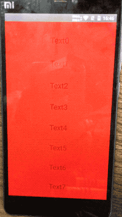

# react-native-spring-scrollview

**react-native-spring-scrollview** 是JavaScript实现的一组高性能弹性ScrollView家族，使用它可以轻松地实现iOS风格的下拉刷新及上拉加载更多，拥有完全一致的视图表现及原生的弹性体验，并且兼容iOS和Android。

## 功能

* iOS原生风格的弹性ScrollView
* iOS和安卓完全一致的视图表现，没有任何平台相关的专有属性
* 媲美原生的滑动体验
* 可高度自定义细节，比如：松手后的阻尼系数，超出内容视图的阻尼系数、减速系数，回弹动画、回弹时间均可配置
* 支持根据滑动偏移自定义原生驱动的动画
* 完成高度自定义的上拉加载更多和下拉刷新是一件非常轻松的事情
* 目前只推出了垂直方向的VerticalScrollView，之后会推出支持横竖同时滑动的SpringScrollView及优化后的LargeList


## 预览




## 接入步骤

该项目依赖 [react-native-gesture-handler](https://github.com/kmagiera/react-native-gesture-handler), 在接入本库之前请先阅读[react-native-gesture-handler接入文档](https://kmagiera.github.io/react-native-gesture-handler/docs/getting-started.html#installation)正确接入react-native-gesture-handler

大概步骤就是：
```$xslt
yarn add react-native-gesture-handler
react-native link react-native-gesture-handler
```

如果不是是用native-navigation或者react-native-navigation则可以直接修改安卓代码

```$xslt
package com.swmansion.gesturehandler.react.example;

import com.facebook.react.ReactActivity;
+ import com.facebook.react.ReactActivityDelegate;
+ import com.facebook.react.ReactRootView;
+ import com.swmansion.gesturehandler.react.RNGestureHandlerEnabledRootView;

public class MainActivity extends ReactActivity {

  @Override
  protected String getMainComponentName() {
    return "Example";
  }

+  @Override
+  protected ReactActivityDelegate createReactActivityDelegate() {
+    return new ReactActivityDelegate(this, getMainComponentName()) {
+      @Override
+      protected ReactRootView createRootView() {
+       return new RNGestureHandlerEnabledRootView(MainActivity.this);
+      }
+    };
+  }
}
```
iOS则不用修改。

如果是使用native-navigation或者react-native-navigation，则需要修改JavaScript代码

```$xslt
import { gestureHandlerRootHOC } from 'react-native-gesture-handler'
import { Navigation } from 'react-native-navigation';
import YourScreen from './YourScreen';

export function registerScreens() {
  Navigation.registerComponent('example.FirstTabScreen', () =>
    gestureHandlerRootHOC(YourScreen));
}
```

到此，[react-native-gesture-handler](https://github.com/kmagiera/react-native-gesture-handler)就已经安装完成。

接下来使用下面命令安装react-native-spring-scrollview

```
yarn add react-native-spring-scrollview
```


## Usage

### 示例：
```
import React from "react";
import { StyleSheet, Text, TouchableOpacity, Easing } from "react-native";
import { VerticalScrollView } from "react-native-spring-scrollview";

export class SpringScrollViewExample extends React.Component {
  render() {
    const arr = [];
    for (let i = 0; i < 30; ++i) arr.push(`Text${i}`);
    return (
      <VerticalScrollView
        style={styles.container}
        contentStyle={styles.content}
        reboundEasing={Easing.cos}
        reboundDuration={300}
        decelerationRateWhenOut={0.9}
        showsVerticalScrollIndicator={true}
        bounces={true}
        scrollEnabled={this.state.scrollEnabled}
        getOffsetYAnimatedValue={() => {
          console.log("getOffsetYAnimatedValue");
        }}
      >
        {arr.map(text =>
          <Text key={text} style={styles.text}>
            {text}
          </Text>
        )}
      </VerticalScrollView>
    );
  }
}

const styles = StyleSheet.create({
  container: {
    flex: 1
  },
  content: {
    alignItems: "center",
    backgroundColor: "red"
  },
  text: {
    marginTop: 40,
    fontSize: 25
  }
});
```


### 属性

属性  |  类型  |  默认值  |  作用  
---- | ------ | --------- | --------
...ViewProps |  | | View的所有属性
bounces | boolean | true | 垂直方向滑动超出内容视图后可以弹性地继续滑动
contentStyle | ViewStyle | null | 内容视图的样式。注意：transform无效
scrollEnabled | boolean | true | 是否可以滚动
onScroll | (offset: Offset) => any | ()=>null | 监听滑动，要使用原生驱动的动画请使用getOffsetYAnimatedValue
showsVerticalScrollIndicator | boolean | true | 显示垂直滚动指示器
decelerationRate | number | 0.998 | 在内容视图内松开手指，减速滑动的阻尼系数，单位是每毫秒百分比
decelerationRateWhenOut | number | 0.9 | 超出内容视图以后松开手指，减速滑动的阻尼系数，单位是每毫秒百分比
dampingCoefficient | number | 0.5 | 超出内容视图以后，继续滑动的阻尼系数，单位是每毫秒百分比
reboundEasing | (value: number) => number | Easing.cos | 超出内容视图松开手指完成减速以后的回弹动画函数
reboundDuration | number | 300 | 回弹的时间
getOffsetYAnimatedValue | (offset: AnimatedWithChildren) => any | ()=>null | 获得支持原生动画的动画值（该值不可监听）


## 目标任务
* 处理键盘
* 高度自定义的下拉及上拉组件
* onContentLayoutChange
* renderIndicator自定义滑动指示器
* 使用此组件重构[react-native-largelist](https://github.com/bolan9999/react-native-largelist)
